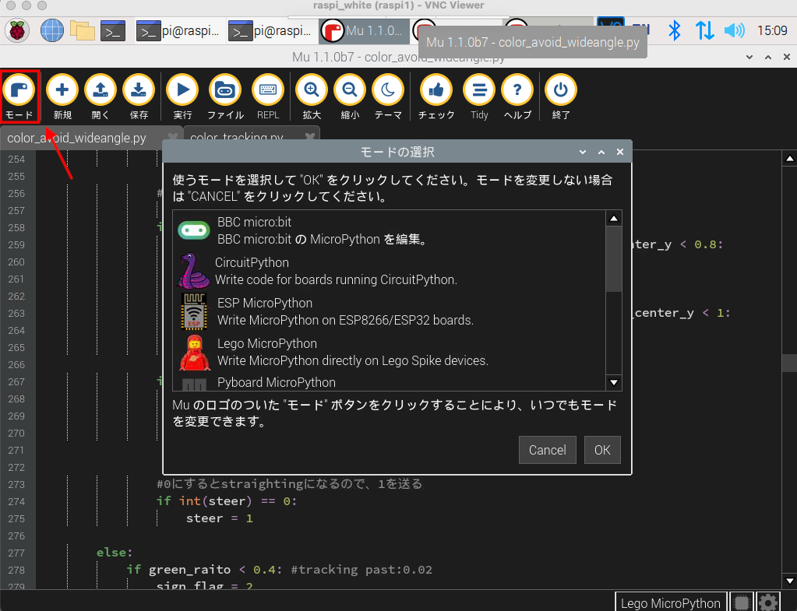
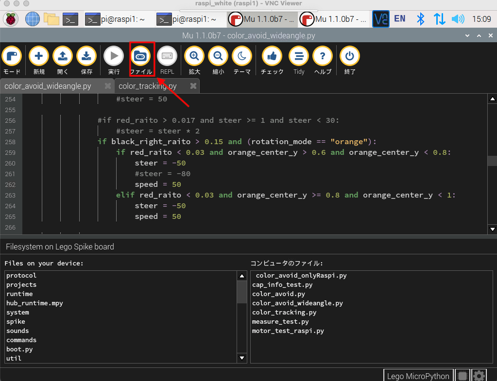

Engineering materials [National Institute of Technology, Ishikawa College]
====
This repository contains materials for participating in WRO Future Engineers2023.

## Team members.
***
Shinichi Uno
Akimasa Hiu
Kandai Kita
Makoto Koshino (Coach)

## Contents
***
* `t-photos` Pictures of team members
* `v-photos` Images of the car body taken from left, right, front and back, and up and down.
* `video` YouTube link to the demonstration video of the trial run.
* `schemes` Diagrams and descriptions of what electromechanical components are used and how they are connected.
* `src` source code to control the vehicle

# `src` Source code description.
***
In the `src` directory, there are two subdirectories, `raspi` and `spike`. The `raspi` directory contains programs to run on the RaspberryPi, and the `spike` directory contains programs to run on the SPIKE Hub.

Both folders contain a large number of python files, but

Only `color_avoid_wideangle.py` in the `raspi` folder and `main.py` in the `spike` folder are executed at the start of the competition
Other files are imported as modules from the tuning program and the main program.

## Program to run on RaspberryPi.
***
On RasbperryPi, it acquires images from a wide-angle camera, detects signs and walls, and calculates the amount of operation.

`color_avoid_wideangle.py`.

During competition, this program is executed. It executes `detect_sign_area()` in `color_tracking.py` described below to obtain information on signs, walls, and ground lines.
Then, using those information, it calculates the values given to the steering motor and drive motor of the vehicle body, and
Sends them to the Hub via serial communication.

`color_tracking.py`.

This module includes the following functions to recognize signs, walls, etc. from image information.

* `red_detect()`

This function detects and binarizes only the red portion of the image acquired by the camera.
There are also functions that work in the same way for green, blue, orange, and black.
* `analysis_blob_line()`, `analysis_blob()`

This function finds connected objects in a binarized image and returns information about the object with the largest area among the objects. It takes a binarized image as argument.
* `detect_sign_area()`

This function takes a camera image as its argument.
Using that image and `analysis_blob_line()`, `analysis_blob()`, and the respective color detect functions, detailed information about the objects on the course is obtained.

## Programs to run on the SPIKE Hub
***

`main.py`

This program is executed on the Hub during the competition. It imports the module for motor control described below, and controls the car body during the competition based on the external information sent from the RaspberryPi.
It is automatically executed when the Hub is started, and waits for the Home button of the Hub to be pressed. When the home button is pressed, it starts running and controls the vehicle while communicating serially with RaspberryPi.

### Module for motor control
`basic_motion.py`

BasicMotion is a class for controlling basic body motions.
The `move()` function takes a speed of the drive motor (throttle) as argument 1 and a rotation angle of the steering motor (steer) as argument 2, and moves the two motors based on the argument values.
 

`gyro.py`

Gyro is a class required for the operation of adjusting the angle of the car body.

The `straightening()` function controls the car body to be at a reference angle.
It requests the speed (throttle) of the drive motor in argument 1 and runs at that speed

The `change_steer()` function changes the direction in which the car should go (reference angle).
It requests the speed of the drive motor (throttle) as argument 1 and the turning direction of the car body (rot) as argument 2. (Argument 3 is basically not used.)
Change the reference angle to be used in straightening() when the vehicle recognizes the blue or orange line.

The `back_turn()` function turns the car backward after changing the reference angle of the car body.
Argument 1 requests the speed of the drive motor (throttle), argument 2 requests the turning direction of the body (rot), and argument 3 specifies the amount of straight-line movement of the body (go_distance).
When the vehicle recognizes the blue or orange line, the reference angle is changed after the vehicle body moves straight ahead by the amount of go_distance.

# Writing and executing programs to SPIKE Hub
***

### Launching the Mu Editor
    
Open a Linux terminal on Raspi and execute the following command.

`pi@raspberry: ~$ source ~/mu-venv/bin/activate` 
`pi@raspberry: ~$ mu-editor`

### Change of description language
The program to be executed on the RaspberryPi is written in Python, while the program to be executed on the Hub is written in MicroPython．

### Upload Program
If you want to upload files from RaspberryPi to SPIKE, click the following button to access the file system on the Hub and drag and drop the files you want to upload.

During a trial run, the program can be run on the Hub by clicking the Run button on the Mu Editor. However, during a competition, you need to click a button on the Hub to start the run, and since the Hub runs a Python file named main.py when it starts up, you should upload the program to be used during the competition with the name main.py.

