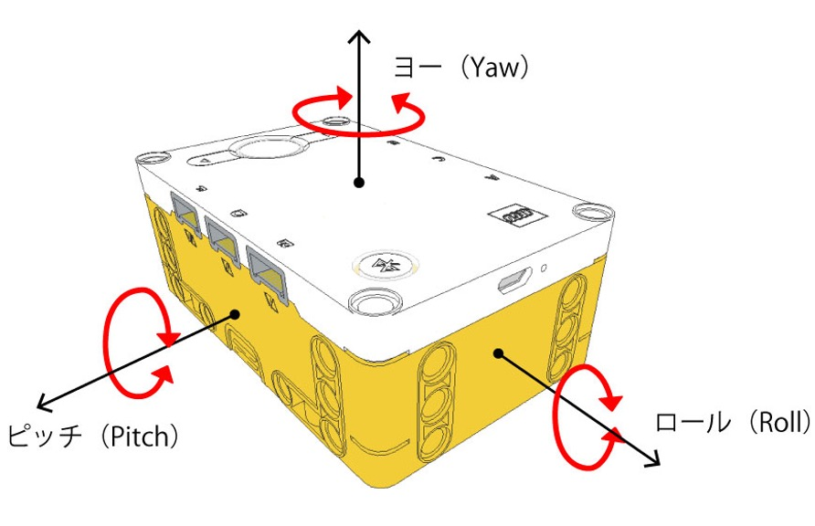
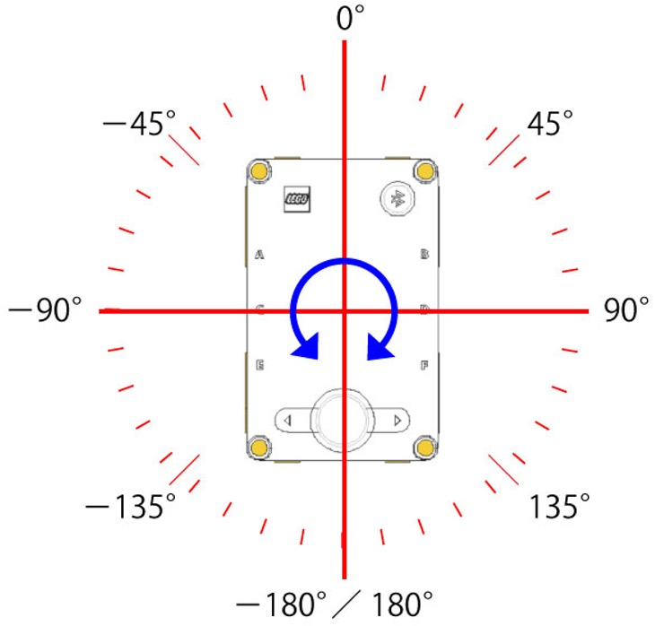

Engineering materials [National Institute of Technology, Ishikawa College]
====
This repository contains materials for participating in WRO Future Engineers2023. Please note that the content is organized into multiple directories to maintain readability.

## Team members.

Shinichi Uno (Born on January 18, 2004) 
Akimasa Hiu (Born on February 16, 2004) 
Kandai Kita (Born on June 18, 2007) 
Takeshi Matsumoto (Coach)

## Contents

* `other` There is an explanatory image used in README.md
* `schemes` Diagrams and descriptions of what electromechanical components are used and how they are connected.
* `src` source code to control the vehicle
* `t-photos` Pictures of team members
* `v-photos` Images of the car body taken from left, right, front and back, and up and down.
* `video` YouTube link to the demonstration video of the trial run.

# `schemes` The car description.

In the `schemes` directory, there are two subdirectories, `mobility` and `power_and_sense`. The `mobility` directory contains mobility management corresponding to reference in the Discussion Section 1, and the `power_and_sense` directory contains power and sense management corresponding to reference in the Discussion Section 2.

# `src` Source code description.

The `src` directory contains three subdirectories: `final`, `qualifier`, and `raspi`.
The `final` and `qualifier` directories contain the code used in the Obstacle and Open competitions. Each directory also contains two subdirectories, `raspi` and `spike`, which contain the code for the RaspberryPi and Spike sides separately. `spike` is LEGO Spike, an educational programmable robotics kit developed by LEGO Education.
The `raspi` directory contains the program that is executed when the RaspberryPi is started. In the Obstacle competition, the contents of this directory are exactly the same as the `final` - `raspi` directory.
Scattered throughout each directory, the `results` directory contains the video footage of the scenery captured by the camera after the car has actually driven.

Both folders contain a large number of python files, but only `color_avoid_wideangle.py` in the `raspi` folder and `main.py` in the `spike` folder are executed at the start of the competition
Other files are imported as modules from the tuning program and the main program.

***
# Obstacle Management
From this point on, a description of the processing that is done for each implemented program will be provided. Note that this corresponds to Discussion Section 3.

## Program to run on RaspberryPi.
On RasbperryPi, it acquires images from a wide-angle camera, detects signs and walls, and calculates the amount of operation. The camera images are mainly analyzed for the red, green, blue, orange, and black colors on the course, respectively. For this analysis, we use opencv, a Python module for image processing.

***
**`color_avoid_wideangle.py`**

* Basic Processing

During the competition, this program is executed. It executes `detect_sign_area()` in `color_tracking.py` described below to obtain information on signs, walls, and ground lines.
Then, using that information, it calculates the values given to the steering motor and drive motor of the vehicle body, and sends them to the Hub via serial communication.

* Determining the direction of the lap

At the first corner, the driver decides whether to turn right or left. SPIKE handles the process of going in the opposite direction on the third lap.

* Avoiding Signs

When red or green is visible over a certain area, a sign is determined to be present and the steering value is updated. Here, not only the area of each color but also the x-coordinate is referenced. For example, if a red sign is visible on the left side, the car will pass on the right side if it continues on its path, so the steering value does not need to be increased much. Conversely, if the red sign is on the right, the car will be on the left and the steering value should be increased.

* When turning, recognize the sign ahead and the nearby wall.

When turning a corner, it is difficult to avoid a sign ahead of the turn. Therefore, we use the visible area and y-coordinate of red and green to determine whether there is a sign or not. We also determine if the turn is close to a wall on the right or left side, or not close to a wall at all. This process dramatically increases the sense of stability when turning corners.

***
**`color_tracking.py`**

* Basic Processing

This module includes the following functions to recognize signs, walls, etc. from image information.

* `red_detect()`

This function detects and binarizes only the red portion of the image acquired by the camera. Some functions work in the same way for green, blue, orange, and black. The following image shows the recognition of a red sign on the course.

 

* `analysis_blob_line()`, `analysis_blob()`

This function finds connected objects in a binarized image and returns information about the object with the largest area among the objects. It takes a binarized image as an argument.

* `detect_sign_area()`

This function takes a camera image as its argument. Using that image and `analysis_blob_line()`, `analysis_blob()`, and the respective color detects functions, detailed information about the objects on the course is obtained. 

Specifically, the area, coordinates, height, width, center, and other values are calculated for the areas that fall within the thresholds. For walls, the process is divided into three patterns: walls visible on the right side, walls visible on the left side, and walls visible in front. These data are used in the subsequent calculation of steering values.

Also, information from outside the course, such as the reflection of surrounding chairs and desks, can interfere with the analysis of the information inside the course. Therefore, we exclude the parts of the course that are outside of the course in our analysis.

 

## Programs to run on the SPIKE Hub

**`main.py`**

* Basic Processing

This program is executed on the Hub during the competition. The module for motor control, described below, is imported and controls the car body during the competition based on external information such as signs and walls sent from the Raspberry Pi and the calculated motor control amount.
It is automatically executed when the Hub is started and waits for the Home button of the Hub to be pressed. When the home button is pressed, it starts running and controls the vehicle while communicating serially with Raspberry Pi.

* Cornering control devices

The car changes the way it turns a corner depending on what sign it sees ahead of it as it turns. For example, if the car is turning clockwise and it sees a red sign at the corner, it turns immediately, but if it sees a green sign, it goes a little further before turning. This reduces sudden changes of direction and increases stability.

* Handling of running in the opposite direction on the third lap

If the color of the sign at the end of the second lap is red, the third lap must be run in the opposite direction. For this reason, the decision to do so, the movements in the corner in such a case, and the subsequent movements are defined. To make this determination, the placement of signs in each section may be recorded.

***
### Module for motor control

**`basic_motion.py`**

* Basic Processing

Here we define a function to set the steering motor to a specified angle and a function to stop the robot. BasicMotion is a class for controlling basic body motions. The file is now renamed and used as `basic_motion_testUNO.py`.

* `move()`

This function sets the steering motor to a specified angle. This function takes the speed of the drive motor (throttle) as argument 1 and the rotation angle of the steering motor (steer) as argument 2, and moves the two motors based on the argument values.

The Python code does have an instruction statement that sets the motor to a specified angle (the run_to_position instruction). However, if this is used as is, the steering angle specification is updated sequentially and the next instruction comes before it moves, and each time it does, the motor keeps trying to make the angle specified by the instruction, resulting in nothing moving. Therefore, we used the "busy" function to command the motor to move "only when the motor is not moving". By combining these actions into a single function, it is possible to easily describe the operation to "set the steering motor to a specified angle.

* `stop()`

This function stops the robot's motors. It is used at the end of three laps.

***
**`gyro.py`**

Gyro is a class required for the operation of adjusting the angle of the car body. The file is now renamed and used as `gyro_testUNO.py`.

* `straightening()`

This function controls the car body to be at a reference angle. It requests the speed (throttle) of the drive motor in argument 1 and runs at that speed. For this process, the yaw angle sensor in the SPIKE Hub is referenced.

   
The image's reference is [here](https://afrel.co.jp/product/spike/technology-spike/prime/hardware/largehub/45931/).

This angle is set to 0 degrees at the start. If the yaw angle of the SPIKE hub is tilted, e.g., after avoiding signs, and you want to run with a 0° orientation, determine the steering value so that the yaw angle tries to return to 0°.

* `change_steer()` 

This function changes the direction in which the car should go (reference angle) in the corner. It requests the speed of the drive motor (throttle) as argument 1 and the turning direction of the car body (rot) as argument 2. (Argument 3 is basically not used.)When the blue or orange line is recognized, a change of direction is required. Again, the yaw angle of the SPIKE hub is used. For example, if you want to turn clockwise, i.e., 90° to the right at the corner, update the yaw angle to ( current yaw angle - 90° ). In this way, the SPIKE hub will know that the right side is the direction to go straight. Then, by trying to return to 0° according to `straightening()`, the car body changes direction by 90° by itself.

# Writing and executing programs to SPIKE Hub

### Launching the Mu Editor
    
Open a Linux terminal on Raspi and execute the following command.

`pi@raspberry: ~$ source ~/mu-venv/bin/activate` 
`pi@raspberry: ~$ mu-editor`

### Change of description language
The program to be executed on the RaspberryPi is written in Python, while the program to be executed on the Hub is written in MicroPython．

### Upload Program
If you want to upload files from RaspberryPi to SPIKE, click the following button to access the file system on the Hub and drag and drop the files you want to upload.

During a trial run, the program can be run on the Hub by clicking the Run button on the Mu Editor. However, during a competition, you need to click a button on the Hub to start the run, and since the Hub runs a Python file named main.py when it starts up, you should upload the program to be used during the competition with the name main.py.

# How to start driving during competition

### Advance preparation
* Import all necessary programs on the Spike side into the Spike Large Hub using the method described in `Upload Program` above. This time, import three programs, `main.py`, `gyro_testUNO.py`, and `basic_motion_testUNO.py`.
