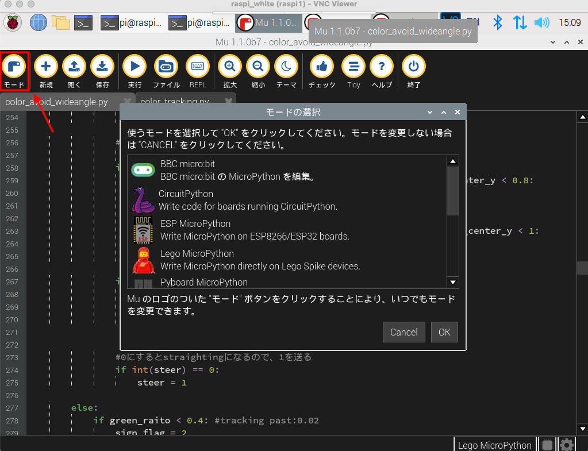

Engineering materials [石川高専B]
====
このリポジトリには，WRO Future Engineers2022に参加する際の資料が含まれています．

## チームメンバー
***
宇野伸一
萬年俊行
坂井俊介（コーチ）

## 内容
***
* `t-photos` チームメンバーの写真
* `v-photos` 車体を左右，前後，上下から撮影した画像
* `video` 試走した際のデモンストレーション動画へのYouTubeリンクです．
* `schemes` どのような電気機械的な構成要素が使われていて，それらがどのように接続されているかの図と説明
* `src` 車体を制御するためのソースコード

# ソースコードの解説
***
`src`ディレクトリには, `raspi`と`spike`の２つのサブディレクトリがあります．`raspi`にはRaspberryPiで動かすプログラムが，`spike`にはSPIKE Hub上で実行するプログラムが含まれています．

どちらのディレクトリにも複数のpythonファイルが入っていますが、競技開始時に実行するのは`raspi`フォルダ内の`color_avoid_wideangle.py`と`spike`フォルダ内の`main.py`のみです
他のファイルは調整用のプログラムやメインのプログラムからモジュールとしてインポートしています．

## RaspberryPi上で実行するプログラム
***
RasbperryPi上では，広角カメラから画像を取得し，標識や壁を検出して操作量を算出します．

`color_avoid_wideangle.py`

競技時はこのプログラムを実行します．後述する`color_tracking.py`内の`detect_sign_area()`を実行し、標識・壁・地面のラインの情報を取得します。
その後、それらの情報を用いて、車体のステアリングモータと駆動モータに与える数値を算出し、
シリアル通信でHubに送信します。

`color_tracking.py`

このモジュール内には，次のように画像情報から標識や壁などを認識するための関数が含まれています．

* `red_detect()`

この関数は、カメラによって取得した画像の中で、赤色の部分だけを検出し二値化を行います。
また、この関数と同様の働きをする関数が、緑色、青色、オレンジ色、黒色についても存在します。
* `analysis_blob_line()`, `analysis_blob()`

この関数は、二値化された画像について、連結オブジェクトを検出し、 そのオブジェクトの中で面積が最大のオブジェクトについての情報を返します。引数には二値化された画像を取ります。
* `detect_sign_area()`

この関数は、引数にカメラ画像を取ります。
その画像と、`analysis_blob_line()`,　`analysis_blob()`,　各色のdetect関数を用いて、 コース上のオブジェクトの詳しい情報を得ます。

## SPIKE Hub上で実行するプログラム
***

`main.py`

競技時にHub上で実行するプログラムです．後述するモータ制御用のモジュールをインポートし，RaspberryPiから送られてきた外界の情報をもとに競技時の車体を制御します．
Hubの起動時に自動的に実行され，Hubのホームボタンが押されるのを待機します．ホームボタンが押された時，走行を開始してRaspberryPiとシリアル通信しながら走行を制御します．

### モータ制御用のモジュール
`basic_motion.py`

BasicMotionは車体の基本的な動作を制御するためのクラスです．

`move()`関数は引数1に駆動モータのスピード(throttle)、 引数２にステアリングモータの回転角度(steer)を要求し、引数の値をもとに2つのモータを動かします

 

`gyro.py`

Gyroは車体の角度を調整する動作に必要なクラスです。

`straightening()`関数は車体を基準角度になるようにP制御する関数です。
引数１で駆動モータのスピード(throttle)を要求し、そのスピードで走行します

`change_steer()`関数は車が進むべき方向（基準角度）を変更する関数です。
引数１で駆動モータのスピード(throttle)、引数２で車体の旋回方向(rot)を要求します。（引数3は基本的に使いません）
車体が青線かオレンジ線を認識した際にstraightening()で使う基準角度を変更します。

`back_turn()`関数は車体の基準角度を変更した後バックしながら車体を旋回させる関数です。
引数１で駆動モータのスピード(throttle)、引数2で車体の旋回方向(rot)を要求します、引数3は車体の直進量(go_distance)を指定します。
車体が青線かオレンジ線を認識した際にgo_distance分だけ車体を直進させた後基準角度を変更します。

# SPIKE Hubへのプログラム書き込みと実行
***

### Muエディタの起動
    
ラズパイ上でLinuxターミナルを開き，次のコマンドを実行します．

`pi@raspberry: ~$ source ~/mu-venv/bin/activate` 
`pi@raspberry: ~$ mu-editor`

### 記述言語の変更
RaspberryPiで実行するプログラムはPythonで記述しますが，Hub上で実行するプログラムはMicroPythonで記述します．Muエディタは次のボタンで記述する言語のモードを切り替えます．

### プログラムのアップロード
RaspberryPiからSPIKEにファイルをアップロードしたい場合は，次のボタンをクリックしてHub上のファイルシステムにアクセスし，アップロードしたいファイルをドラッグ&ドロップします．

試走時は，Muエディタの実行ボタンをクリックすれば，Hub上でそのプログラムを動かせます．しかし，競技時はHubのボタンを押すことで走行を開始する必要があります．Hubは起動時にmain.pyという名前のPythonファイルを実行するので，競技時に使うプログラムはmain.pyという名前でアップロードしておきます

