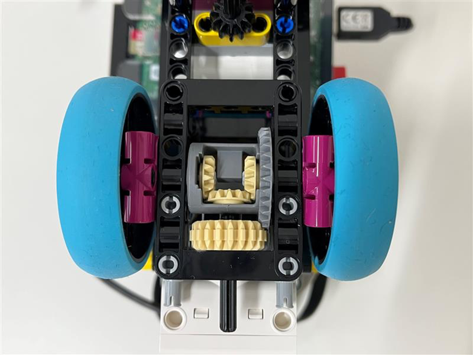
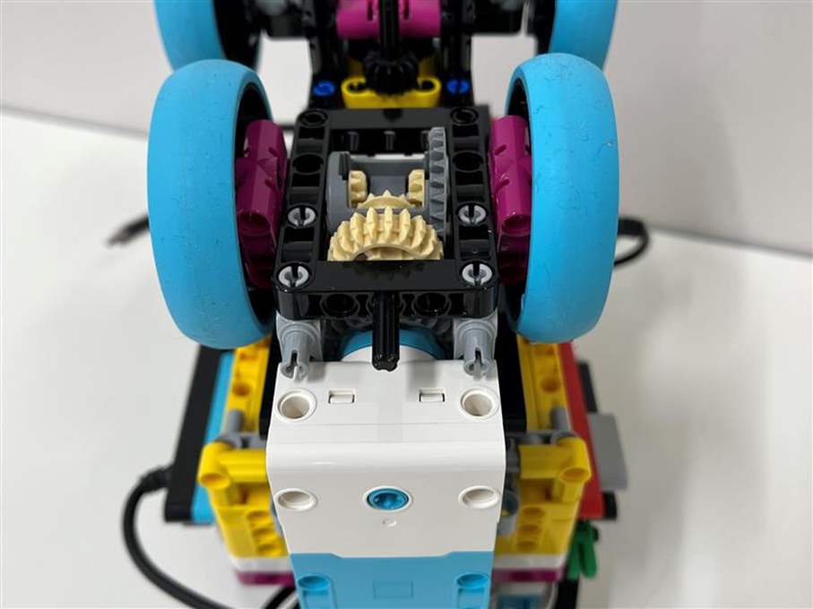
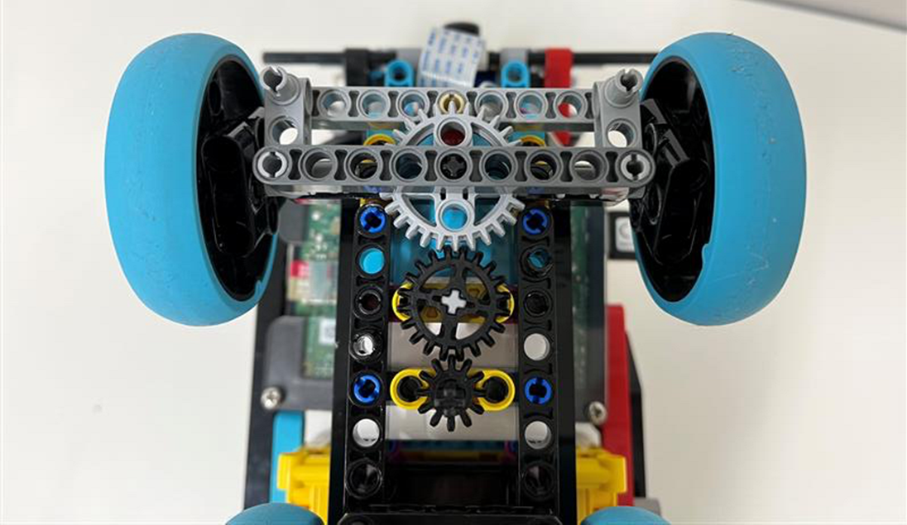
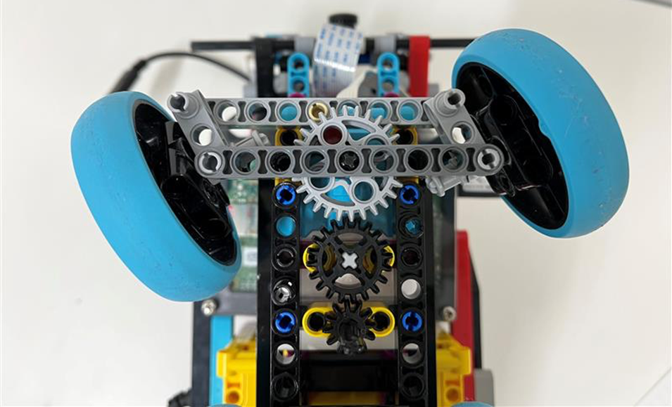
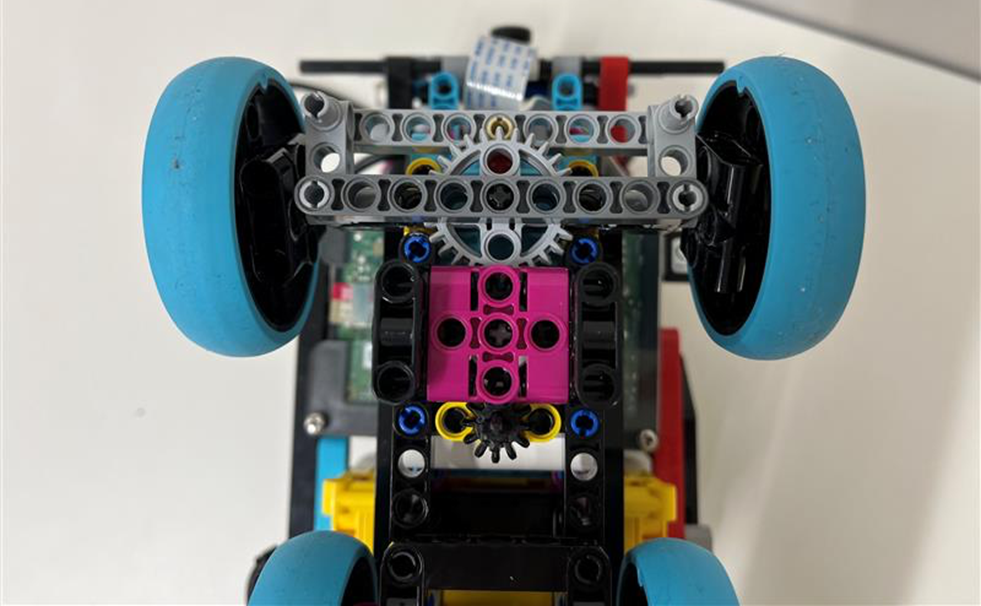

Mobility management
====

## Explanation of a simple method of transportation

Our robot is a 4-wheeled car with two motors. The back two wheels are for driving and the front two wheels are for steering control(rear-wheel drive).
The two motors are connected to a SPIKE L hub and controlled using the Python language.
***
## Implementation of the drive mechanism

The drive mechanism does not simply connect the drive motor and tires but uses differential gears. 
This mechanism is made from a combination of LEGO parts and can be easily reproduced. 
We used Sanuki Tech Net's [website](https://sanuki-tech.net/micro-bit/lego/tricycle-differential-gear/ ) as a reference for assembly.

    

Image of the part where the differential gear is used

The role of this gear is to absorb the difference in speed between the inside and outside of a curve while transmitting the power from the engine to both the left and right axles so that the car can make the turn successfully. This mechanism is perfect for this competition, in which many turns are required, such as when changing direction according to a sign or a corner of a course.
***
## Implementation of the steering mechanism

The steering mechanism is a simple mechanism that controls the angle of the tires by the magnitude of the angle at which the motor rotates. If the rotation of the motor is transmitted directly to the tires, fine control is difficult, so gears are used to slow down the movement of the tires.
The motor rotation is controlled by the size of the motor's bolt and the position of the tires.

    

Image of the realized steering mechanism

The gear parts are held in place by separate parts to prevent them from falling.

It's holding down the gears.

Here, the gear directly connected to the motor has 9 teeth, the second has 20 teeth, and the third has 28 teeth.
In other words, the rotation of the motor is multiplied by 9/28≒0.32 and transmitted as the angle of the tire. In other words, the design is such that when the motor is moved 30 degrees, the tire moves approximately 10 degrees.
***
## About Motors

### Selected motor

SPIKE Prime L Angular Motor * 2 (for drive and steering control)

### Motor Specifications

| part                         | Description                                                                           |
|------------------------------|---------------------------------------------------------------------------------------|
| Connector type               | LEGO® Power Functions 2.0 (LPF2) for connection to LEGO Smarthubs                     |
| Wire length                  | 250 mm                                                                                |
| Motor output(Voltage range)  | 5[V] ~ 9[V]                                                                           |
| Motor output(No load)        | Torque: 0 Ncm  Speed: 175 RPM +/- 15%  Current consumption: 135 mA +/- 15%      |
| Motor output(Maximum efficiency) | Torque: 8 Ncm  Speed: 135 RPM +/- 15%  Current consumption: 430 mA +/- 15%      |
| Motor output(Stall)          | Torque: 25 Ncm  Speed: 0 RPM +/- 15%  Current consumption: 1900 mA +/- 15%      |
| Sensor input                 | Resolution: 360 counts per revolution   Accuracy: Accuracy: ≤+/- 3 degrees   Update rate: 100 Hz|

The official specifications for the components of SPIKE Prime can be found [here](https://github.com/gpdaniels/spike-prime/tree/master/specifications/spike-prime).
***
## A rough explanation of the overall structure of the car

The car is based on the contents of the LEGO Education SPIKE Prime set.
The car body is designed and built based on the contents of the LEGO Education SPIKE Prime set, combined with LEGO parts such as Raspberry Pi, a camera module, and a mobile battery.
Raspberry Pi, camera module, and mobile battery are not LEGO parts, so the framework was designed and built with LEGO parts to create a space to install them.
And space to install them. In particular, the camera module can be installed without disturbing the camera image, the camera is installed slightly downward and there is no impact on driving.
Furthermore, care was taken to ensure that the weight of the wires would not be so heavy as to affect driving.

***
## Development environment

Development is done by displaying the screen of RaspberryPi4 running on RaspberryPi OS to a PC with MacOS using an application called VNC Viewer.
Wireless connection via Wi-Fi is also possible, but this time we will use a wired connection with a LAN cable.
The Python code is written using Mu-editor.
Mu-editor is an editor that supports both Python3 and LEGO micro Python,
It can not only execute programs on SPIKE and Raspberry but also write programs to the SPIKE hub.