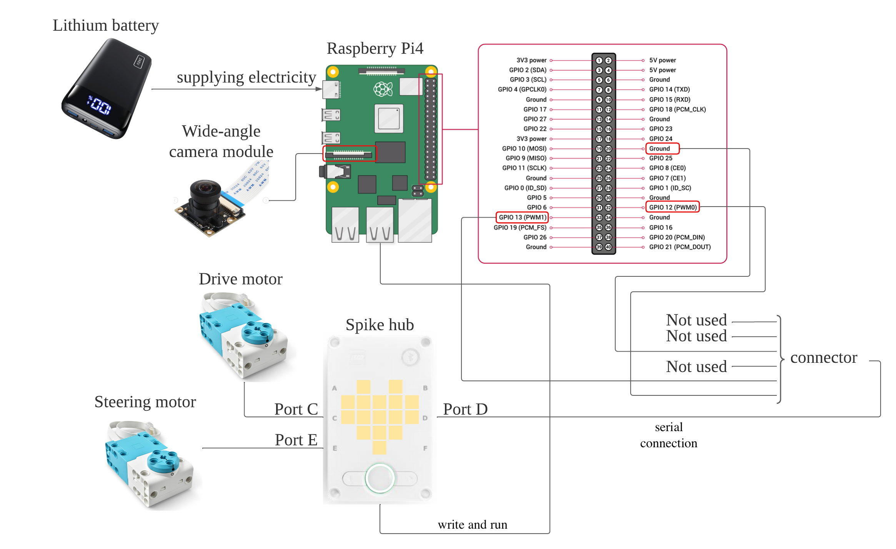
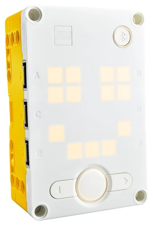
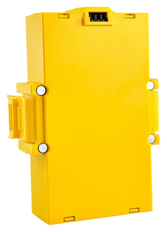
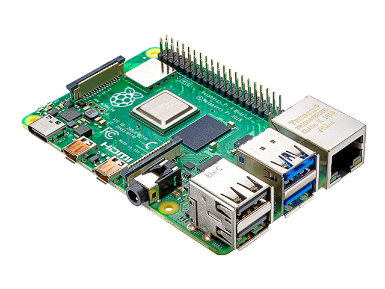
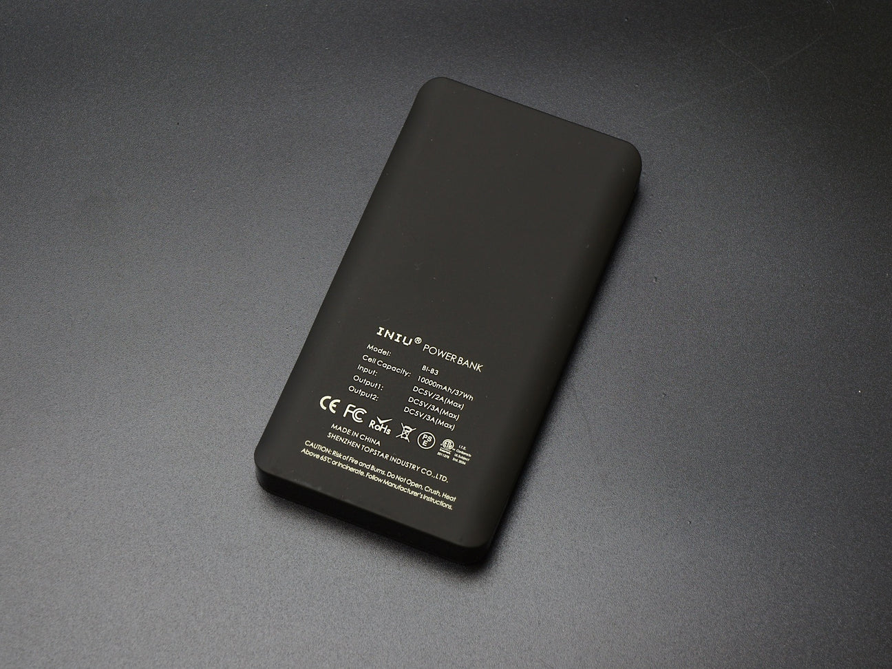
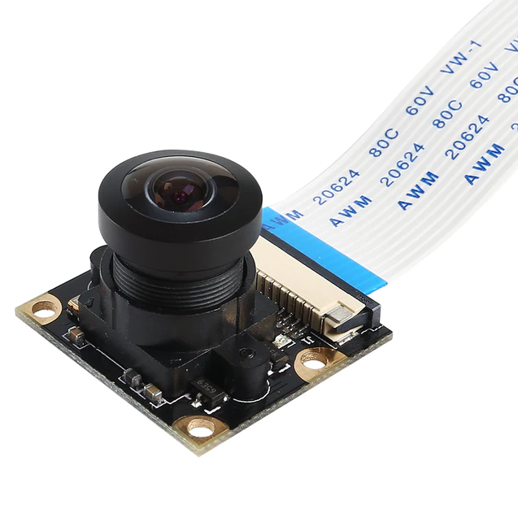
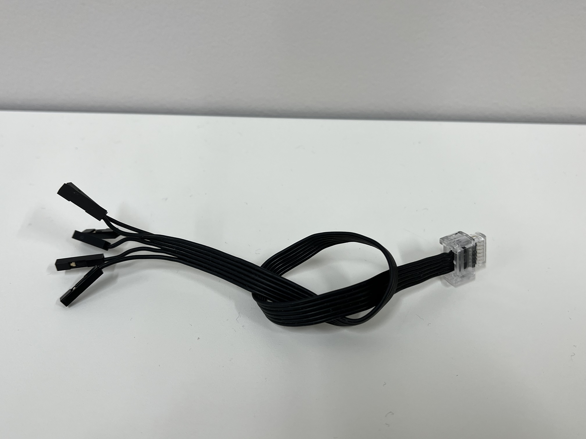

Power and sense management
====

This directory primarily contains the Mobility Management content referenced in Discussion Section 1.

# System Configuration Chart

***
# SPIKE Prime Hardware

## 1. Large Hub 

### Product Information
| part                  | Description                                                             |
|-----------------------|-------------------------------------------------------------------------|
| CPU                   | STM32F413 (Architecture: ARM Cortex M4, ROM: 1M, RAM: 320k, Clock: 100MHz) |
| Power                 | Requires large hub battery (batteries are not acceptable)               |
| Sense                 | Built-in 6-axis gyro sensor    3-axis acceleration sensor + 3-axis gyro sensor    Gyroscope mode (3-axis)/Acceleration/Tilt mode (3-axis)    Tap/double-tap/shake gesture detection               |
| Button                 | 3 buttons    center button:Large hub on/off, Select/run programs    Left button, right button: program selection             |
| Internal storage      | 32MB flash memory (IC: Winbond W25Q256JV)                               |
| Wireless connectivity | Bluetooth supporting 1 BT and 4 BLE connections (IC: TI CC2564C)        |
| Wired connectivity    | Micro USB cable                                                         |
| Display               | 25 white LEDs in a 5x5 grid and 1 RGB LED (Driver IC: TI TLC5955)       |
| Motor Drivers         | 	6 motor outputs (Driver ICs: 3 x LB1836)  |
| Battery Management    | Lithium ion battery management (IC: MPS 2639A)   |
| Accerometer           | Three-axis accelerometer (IC: LSM6DS3TR) |
| Gyroscope             | Three-axis gyroscope (IC: LSM6DS3TR)       |
| Ports                 | 6 LPF2 ports = 4 normal speed (115kB), 2 high speed (?kB) Input/Output dual use               |

### Reasons for selecting this part
* Easy integration with Raspberry Pi.
* Easy and accurate control of motor mechanisms using Python.
* I have handled it since middle school and have experience and knowledge.

### How this is used
The Spike Large Hub (hereafter Hub) is a programmable control unit that can be used to control a variety of sensors and motors. The sensor on the Spike side is a gyro sensor built into the Hub. Based on the value of this sensor and the control amount sent from the Raspberry Pi via serial communication, the final control amount of the motor is determined and the actual control is performed. The language used is Python (Lego MicroPython to be precise).

Reference is [here](https://github.com/gpdaniels/spike-prime/blob/master/specifications/spike-prime/large-hub.pdf)

***
## 2. Large Hub Battery

### Product Information
| part                  | Description                                                             |
|-----------------------|-------------------------------------------------------------------------|
| Features | Rechargeable lithium-ion battery for SPIKE Prime Large Hub |
| Rated capacity | 2100mAH |
| Rated voltage | 7.3V |
| At watt-hour Rated capacity | 15.33Wh (calculated from rated capacity and rated voltage) Lifetime: 500 cycles |
| Charging | Charged via micro USB cable Charging time depends on the capability of the charger used. |

### Reasons for selecting this part
* The battery is compatible with Spike large hubs.

### How this is used
This battery is used to power the Hub.

Reference is [here](https://github.com/gpdaniels/spike-prime/blob/master/specifications/spike-prime/large-hub-rechargeable-battery.pdf)

***
# Raspberry pi Hardware

## 1. RaspberryPi 4 modelB

### Product Information
| part          | Description                                                                                                                                                 |
|---------------|-------------------------------------------------------------------------------------------------------------------------------------------------------------|
| Processor     | Broadcom BCM2711 quad-core Cortex-A72 (ARM v8) 64-bit SoC @ 1.5GHz                                                                                          |
| Memory        | 8GB                                                                                                                                                         |
| Connectivity  | 2.4 GHz and 5.0 GHz IEEE 802.11b/g/n/ac wirelessLAN, Bluetooth 5.0, BLE Gigabit Ethernet 2 × USB 3.0 ports 2 × USB 2.0 ports.                      |
| GPIO          | Standard 40-pin GPIO header                                                                                                                                 |
| Video & sound | 2 × micro HDMI ports (up to 4Kp60 supported) 2-lane MIPI DSI display port 2-lane MIPI CSI camera port 4-pole stereo audio and composite video port |
| Multimedia    | H.265 (4Kp60 decode); H.264 (1080p60 decode, 1080p30 encode); OpenGL ES, 3.0 graphics                                                                 |
| SD card support              | Micro SD card slot for loading operating system and data storage                                                                                            |
| Input power              | 5V DC via USB-C connector (minimum 3A1) 5V DC via GPIO header (minimum 3A1) Power over Ethernet (PoE)–enabled(requires separate PoE HAT)                                                                                                                                                            |
| Environment                         | Operating temperature 0–50ºC                                                                                                                                                                                                                                                    |

### Reasons for selecting this part
* It is lightweight, fast, and the easiest-to-use single-board computer we can handle.
* Compatible with SPIKE.
* It is highly flexible and can use a variety of sensors.
* It is relatively inexpensive and can handle breakdowns and problems.

Reference is [here](https://www.iodata.jp/product/pc/raspberrypi/ud-rp4b/spec.htm)

### How this is used
The Raspberry Pi 4 is a small single-board computer. It is responsible for processing and analyzing images obtained from the camera in real-time. The language used is Python and the cv2 library is used for image processing. The image analysis determines the amount of control for the motors based on the view captured from the camera. The calculation results are sent to the Hub using serial communication.

***
## 2. Lithium Battery

### Product Information
| part       | Description           |
|------------|-----------------------|
| capability | 10000mAh/37Wh         |
| input      | 5V/3A(maximum)        |
| output     | 5V/3A(maximum)        |
| size       | 13.2 * 6.8 * 1.2 [cm] |
| weight     | 198 [g]               |

### Reasons for selecting this part
* The power supply does not turn off by itself.
* Automatic switching between external power supply and battery power supply.
* A stable power supply to the Raspberry Pi.

### How this is used
It is used to supply power to the Raspberry Pi4. This power is further supplied to the Hub via a cable.

Reference is [here](https://www.iodata.jp/product/pc/raspberrypi/ud-rp4b/spec.htm)

***
## 3. Camera module

### Product Information
| part           | Description                                                                                            |
|----------------|--------------------------------------------------------------------------------------------------------|
| Compatibility  | Raspberry Pi model A/B                                                                                 |
| Powered by     | 5 MP Omnivision 5647 camera module                                                                     |
| Resolution     | 2592 * 1944                                                                                            |
| FOV            | 160 [degree]                                                                                           |
| Video          | 1080 p @ 30 fps 720 p @ 60 fps 640 x 480 p 60/90                                               |
| size           | 25×24×9[mm]  0.99×0.95×0.36 [inch]                                                                 |

### Reasons for selecting this part
* Raspberry Pi is supported.
* With a 160-degree viewing angle, it is possible to see a wide area at a time.
* high resolution (of an image).

### How this is used
The camera is used in this vehicle to assess the surroundings. No other sensors, such as distance sensors, are used, and this camera is the only way to understand the surroundings. In other words, the camera recognizes not only the signs but also the walls on both sides. The resulting images are processed on a Raspberry Pi using the Python language.

Reference is [here](https://jp.sainsmart.com/products/wide-angle-fov160-5-megapixel-camera-module-for-raspberry-pi)

# Cables

## 1. GPIO - Spike Hub Port Connector

### Reasons for selecting this part
* Enables simple wired connection between RaspberryPi4 and Spike.

### How this is used
Used for serial communication between SPIKE and Raspberry Pi.The GPIO side is plugged into the GPIO pins of the Raspberry Pi, and the Spike Hub Port side is connected to the Spike Hub. Please refer to the [System Configuration Chart](#system-configuration-chart) for the connection method.

***
## 2. USB Type A - USB Type C Connector

### Reasons for selecting this part
* Able to provide a stable power supply.

### How this is used
It is connected between the mobile battery and the Raspberry Pi and supplies power from the battery to the Raspberry Pi.The USB Type A side plugs into the mobile battery's output port, and the USB Type C side plugs into the Raspberry Pi's power supply port.

***
## 3. USB Type A - Micro USB Type B Connector

### Reasons for selecting this part
* Able to provide a stable power supply.

### How this is used
The USB Type A side is connected to a USB 2.0 Standard A port and the Micro USB Type B side is connected to the Spike Hub's Micro USB Type B port.

***
## 4. Spike L Motor - Spike Hub Port Connector

### How this is used
This cable is a non-removable wire that is an integral part of the SPIKE Prime L angular motor; it connects to the Spike hub port and provides the connection between the Spike Hub and the motor.

***
## Flexible flat cable 15-pin

### How this is used
This cable is integrated with the camera module and is used to connect the Raspberry Pi. The cable is plugged into the connection on the Raspberry Pi side for connection. I used [this site](https://tora-k.com/2020/11/15/raspberrypi4-cammoj/) as a reference for how to plug it in.

***
# Explanation of how power is supplied
When you run a Raspberry Pi on a typical mobile battery,
* The power feed drops out on its own.
* USB power supply and battery power supply do not switch.

As described above, this is not a suitable power supply for the Raspberry Pi because of its intelligent features for smartphones.The Lithium-ion Battery Expansion Board for Raspberry Pi is used to solve the problem of power loss and the problem of not switching between USB power and battery power. The Lithium-ion Battery Expansion Board for Raspberry Pi is powered by the mobile battery and relays power to the Spike Hub.
