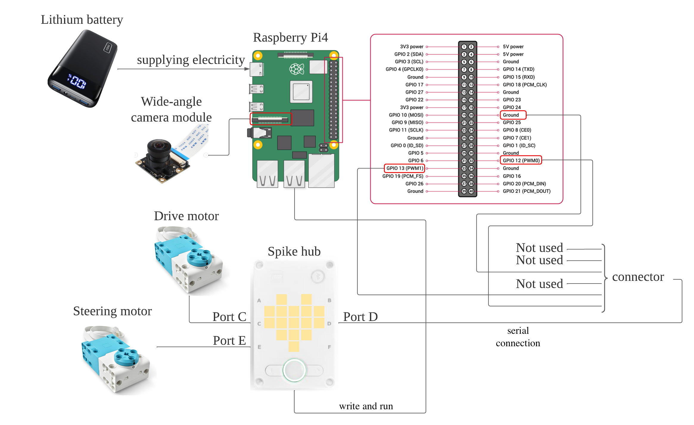

Power and sense management
====
This directory contains mobility management corresponding to reference in the discussion sections 1.

### System Configuration Chart
***

***
### SPIKE Prime Hardware

## 1. Large Hub 

| part                  | Description                                                             |
|-----------------------|-------------------------------------------------------------------------|
| CPU                   | STM32F413 (Architecture: ARM Cortex M4, ROM: 1M, RAM: 320k, Clock: 100MHz) |
| Power                 | Requires large hub battery (batteries are not acceptable)               |
| Sense                 | Built-in 6-axis gyro sensor    3-axis acceleration sensor + 3-axis gyro sensor    Gyroscope mode (3-axis)/Acceleration/Tilt mode (3-axis)    Tap/double-tap/shake gesture detection               |
| Button                 | 3 buttons    center button:Large hub on/off, Select/run programs    Left button, right button: program selection             |
| Internal storage      | 32MB flash memory (IC: Winbond W25Q256JV)                               |
| Wireless connectivity | Bluetooth supporting 1 BT and 4 BLE connections (IC: TI CC2564C)        |
| Wired connectivity    | Micro USB cable                                                         |
| Display               | 25 white LEDs in a 5x5 grid and 1 RGB LED (Driver IC: TI TLC5955)       |
| Motor Drivers         | 	6 motor outputs (Driver ICs: 3 x LB1836)  |
| Battery Management    | Lithium ion battery management (IC: MPS 2639A)   |
| Accerometer           | Three-axis accelerometer (IC: LSM6DS3TR) |
| Gyroscope             | Three-axis gyroscope (IC: LSM6DS3TR)       |
| Ports                 | 6 LPF2 ports = 4 normal speed (115kB), 2 high speed (?kB) Input/Output dual use               |

## 2. Large Hub Battery
| part                  | Description                                                             |
|-----------------------|-------------------------------------------------------------------------|
| Features | Rechargeable lithium-ion battery for SPIKE Prime Large Hub |
| Rated capacity | 2100mAH |
| Rated voltage | 7.3V |
| At watt-hour Rated capacity | 15.33Wh (calculated from rated capacity and rated voltage) Lifetime: 500 cycles |
| Charging | Charged via micro USB cable Charging time depends on the capability of the charger used. |
References are [these](https://afrel.co.jp/product/spike/technology/spec/)
